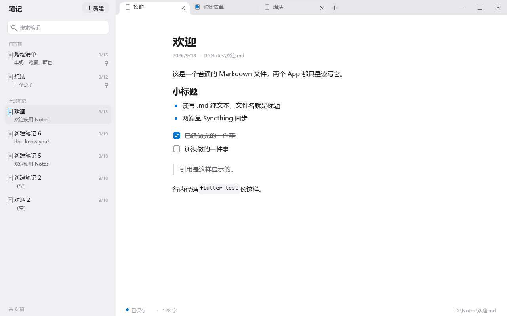
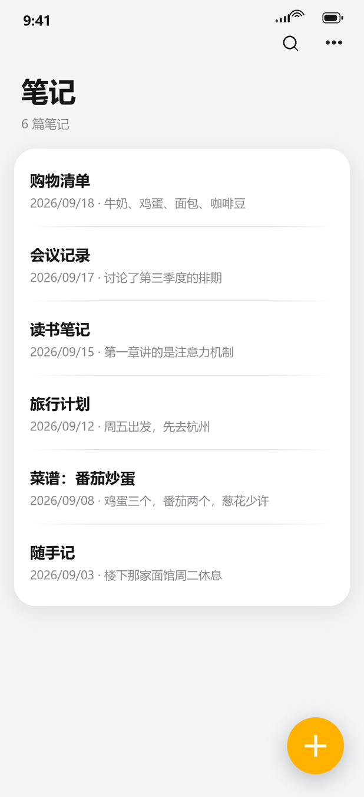
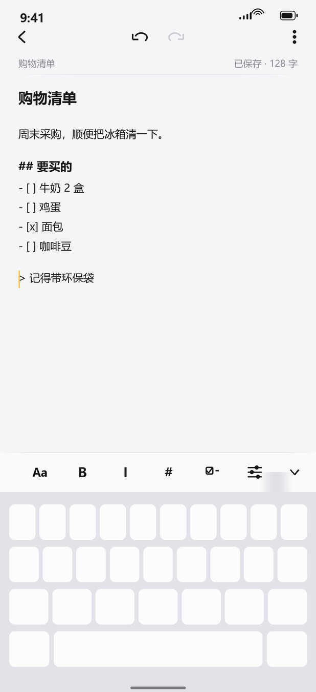
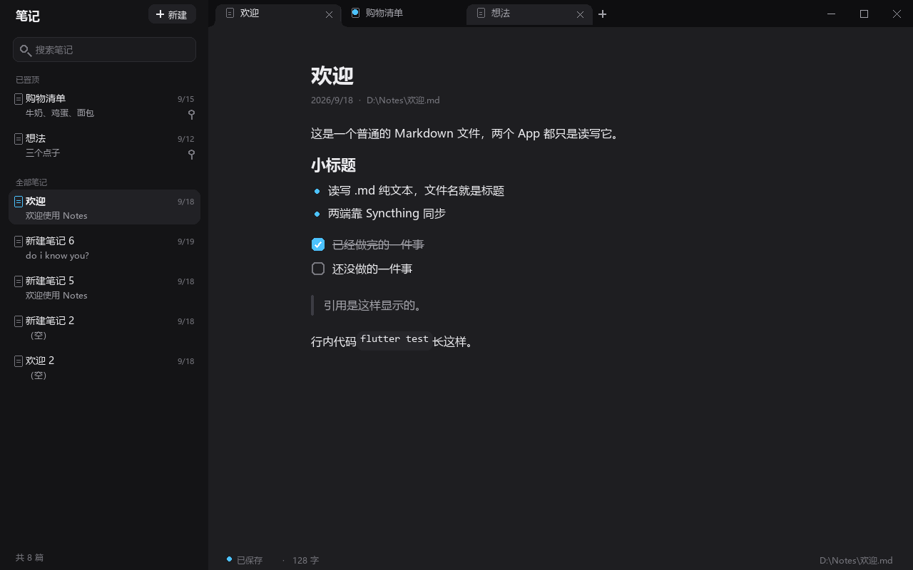

# Notes

一个**极简的 Markdown 记事本**：**文件夹就是数据库**——每一篇笔记都是一个普通的 `.md`
文本文件，放在电脑（和手机）的一个文件夹里，用 [Syncthing](https://syncthing.net/) 两边双向同步。

- **不联网、没有账号、没有云端**：程序不上传任何东西，数据始终是你自己文件夹里的文件。
- **两个平台**：Windows 桌面版 + 安卓版，共用同一套数据层与 Markdown 渲染。
- **文件在哪都行**：记事本能打开的文本，这个程序就能打开；反过来也一样。





> 上面两张是定稿的设计稿（界面以实机为准）。下图左边是手机版写待办的样子，右下角工具条是
> 格式面板。




---

## 目录

- [下载与安装](#下载与安装)
- [第一次使用](#第一次使用)
- [笔记、文件夹和同步](#笔记文件夹和同步)
- [电脑版有什么](#电脑版有什么)
- [手机版有什么](#手机版有什么)
- [快捷键](#快捷键)
- [搜索的写法](#搜索的写法)
- [菜单和按钮都在哪](#菜单和按钮都在哪)
- [「有人改过这篇」和刷新按钮](#有人改过这篇和刷新按钮)
- [数据放在哪、怎么备份、删了去哪](#数据放在哪怎么备份删了去哪)
- [常见问题](#常见问题)
- [从源码构建](#从源码构建)
- [项目结构](#项目结构)
- [已知限制](#已知限制)

---

## 下载与安装

到 [Releases](https://github.com/pphun811-maker/notes_app/releases) 页面下载，或直接用下面的直链：

| 平台 | 文件 | 说明 |
|---|---|---|
| Windows | [`notes_app-1.0.0-windows-x64.zip`](https://github.com/pphun811-maker/notes_app/releases/download/v1.0.0/notes_app-1.0.0-windows-x64.zip) | 约 11 MB，解压即用 |
| 安卓 | [`notes-app-1.0.0-android.apk`](https://github.com/pphun811-maker/notes_app/releases/download/v1.0.0/notes-app-1.0.0-android.apk) | 约 48 MB |

### Windows

1. 把 zip 解压到任意文件夹（比如 `D:\Program Files\Notes`）。**不要只把 exe 拖出来**，
   它旁边的 `data\` 文件夹和 `flutter_windows.dll` 是程序的一部分。
2. 双击 `notes_app.exe`。
3. 如果 Windows 弹出蓝色的「已保护你的电脑」：点**更多信息** → **仍要运行**。
   这是没有购买代码签名证书的个人软件都会有的提示，不是病毒警告。
4. 想放在开始菜单/桌面：右键 `notes_app.exe` → 发送到 → 桌面快捷方式。

第一次打开会在 `D:\Notes` 建好文件夹（不存在就创建），并放一篇《欢迎》说明。

### 安卓

1. 下载 apk，点开安装。系统会问一次**允许安装未知应用**（因为不是从应用商店装的）。
2. 第一次打开会显示一页**「所有文件访问权限」**：要读写手机上的笔记文件夹，必须授予这个权限。
   点「去授权」→ 在系统设置里打开这个开关 → 回来点「我已授权，重新检查」。
3. 笔记文件夹是 `/storage/emulated/0/Notes`（就是手机文件管理器里的 `内部存储/Notes`）。

> 手机上也可以直接在浏览器里下载这个 apk（仓库和附件都是公开的，不用登录）。

## 第一次使用

| 你想做的事 | 怎么做 |
|---|---|
| 写新笔记 | 电脑：左上角「＋ 新建」；手机：右上角「＋」 |
| 改标题 | **标题就是文件名**——直接改标题那一行，光标离开时文件就改名了（电脑上也可以按 F2） |
| 保存 | **不用保存**，停下打字几秒就自动写了（状态栏会显示「正在保存…」/「已保存 · N 字」） |
| 打开已写过的笔记 | 电脑：点左边的列表，或点标签栏的「＋」旁边；手机：点列表里那一篇 |
| 同时打开好几篇 | 电脑：每次点列表里的笔记就多一个标签，可以按中键关掉标签 |
| 找词 | 电脑：左边搜索框（搜所有笔记）或 Ctrl+F（只搜当前这篇）；手机：右上角放大镜 |
| 回到列表 | 手机：左上角「←」 |

## 笔记、文件夹和同步

### 笔记就是文件

- 一篇笔记 = 一个 `.md` 文件，**文件名（去掉 .md）就是标题**。
- 内容就是 Markdown 原文：`# 标题`、`**加粗**`、`- [ ] 待办`、`> 引用`、`` `行内代码` ``
  都会渲染出来；按状态栏的「源码」（手机在 ⋯ 菜单里）可以看没渲染的原样。
- 用系统记事本、VS Code、任何编辑器改它都行，程序会自己发现并载入新内容。

### 文件夹在哪

| 平台 | 位置 |
|---|---|
| Windows | `D:\Notes` |
| 安卓 | `/storage/emulated/0/Notes` |

### 同步是 Syncthing 干的，不是这个程序

程序只负责**读写本地文件**；两边怎么互通，交给 Syncthing。大致步骤：

1. 电脑上装 Syncthing（[官网下载](https://syncthing.net/downloads/)），跑起来后浏览器会打开
   管理页面（默认 `http://127.0.0.1:8384`）。
2. 手机上装 **Syncthing-Fork**（应用商店或 [GitHub](https://github.com/Catfriend1/syncthing-android/releases)），
   打开它。
3. 两边**互相添加设备**：在一台的界面里点「添加设备」，把另一台的**设备 ID**（一串带横杠的字符，
   会显示成二维码）输进去/扫进去，另一边确认。
4. 在电脑上「添加文件夹」→ 文件夹 ID 随便写（例如 `notes`）→ 路径选 `D:\Notes` →
   在「共享」里勾上手机那台设备。
5. 手机上接受这个文件夹，路径指向 `/storage/emulated/0/Notes`。
6. 之后两边都是「双向同步」：改哪边都一样。

**同步慢或者没到怎么办？**

- 同步是 Syncthing 在后台跑，安卓会"冻结"后台的它，所以偶尔要等一会儿（实测有时 15 秒就到，
  有时两分钟还没到）。
- 两边程序里都有**手动刷新**（见下一节）——它会立刻重读磁盘上的内容，并告诉你是"已经更新"还是
  "同步还没传过来"。
- 手机上建议给 Syncthing 打开「后台常驻 / 不要省电优化」。

## 电脑版有什么

| 功能 | 说明 |
|---|---|
| 多标签 | 同时开好几篇，中键关闭，标签多了会像浏览器一样变窄、可以横向滚动 |
| 自动保存 | 停止输入约半秒就写文件 |
| 外部改动保护 | 别人（或 Syncthing）改了你在编辑的这篇，会弹提示让你选保留哪个版本 |
| 全文搜索 | 搜正文任意一行；结果里显示的是**命中那一行** |
| 高级搜索写法 | `-词`、`标题:词`、`之后:2026/9/1`（见 [搜索的写法](#搜索的写法)） |
| 文内查找 | Ctrl+F：高亮全部命中，上下跳，到头回绕 |
| 删除 | 进 **Windows 回收站**（不是永久删除），删前会问一次 |
| 右键菜单 | 列表里每篇可以：打开 / 重命名 / 在资源管理器中显示 / 复制路径 / 置顶 / 删除 |
| 置顶 | 置顶的笔记单独一组，排在列表最上面（**只存在这台电脑上**，不写进笔记、不跟着同步） |
| 看源码 | 状态栏的「源码」按钮，随时在渲染和原文之间切 |
| 冲突副本提示 | Syncthing 留下冲突副本时，编辑器上方会出现一条提示，可以查看或忽略 |
| 深色 / 浅色 / 跟随系统 | 顶栏的太阳/月亮按钮 |
| 侧边栏收起 | Ctrl+B，或者左上角那三条杠 |
| 单实例 | 双击两次图标不会开出两个程序：第二次会把已经开着的窗口提到最前面 |
| 手动刷新 | 状态栏的「刷新」，见后面 |

## 手机版有什么

| 功能 | 说明 |
|---|---|
| 笔记列表 | 每行显示标题、日期、正文第一行 |
| 编辑 | 标题一行、正文若干行；自动保存 |
| 格式工具条 | 加粗 / 斜体 / 标题 / 待办 / 分割线 / 列表 / 引用 / 插入日期 |
| 格式面板（Aa） | 字号 12–24、行距、系统字体/等宽字体——**这个设置会记住** |
| 撤销 / 重做 | 顶部两个箭头 |
| 搜索 | 右上角放大镜，和电脑一样支持高级写法 |
| 选择 / 删除 | 长按一篇进入多选，右上角垃圾桶；**手机上是永久删除**，删前会问 |
| 冲突副本 | 有 Syncthing 冲突副本时会显示专门的页面 |
| 手动刷新 | 编辑器右上角 ⋯ 菜单里的「再看一眼磁盘上的版本」 |
| 切回前台自动检查 | 从别的应用切回笔记时，如果磁盘上有新版本、这里又没有没保存的字，会自动更新 |

## 快捷键

### 电脑版

| 按键 | 作用 |
|---|---|
| `Ctrl` + `F` | 在当前这篇里查找（`Enter` 下一个、`Esc` 关闭） |
| `Ctrl` + `B` | 收起 / 展开左边的列表 |
| `Ctrl` + `W` | 关闭当前的标签（只是关掉，不删文件） |
| `F2` | 改名：光标跳到标题并全选，直接打字就是新名字 |
| `Delete` | 删除当前这篇（会先问一次，删到回收站） |
| 鼠标中键点标签 | 关闭那个标签 |
| 双击标签栏空白处 | 最大化 / 还原窗口 |

> `Delete` 只在光标**不在输入框里**时才删笔记；在正文里按 Delete 还是普通地删字符。

### 手机版

系统自带的手势：长按选择、左右滑动手势交给系统（返回）。编辑器里点 ⋯ 有「复制为纯文本 /
复制为 Markdown / 再看一眼磁盘上的版本」。

## 搜索的写法

搜的是**标题或正文任意一行**（电脑和手机一样）：

| 写法 | 含义 |
|---|---|
| `牛奶` | 标题或正文里出现这个词就行 |
| `"两个 词"` | 这一串字连着出现（引号没写全也按整句处理） |
| `-牛奶` | **不含**这个词 |
| `标题:购物` / `title:购物` | 只在标题（文件名）里找 |
| `之后:2026/9/1` / `after:` | 那天及以后改过的 |
| `之前:2026/9/20` / `before:` | 那天之前改过的 |

几条规则：

- 写几个词是**"都要有"**，不是"有一个就行"——第二个词是用来收窄的。
- **看不懂的写法当普通文字搜**（`之后:明年` 就去找这串字），不会偷偷丢掉条件。
- **没写完的操作符不算数**（只写 `标题:` 单独出现时什么都不筛）。
- 日期可以只写年（`2026`）或年月（`2026/9`），都表示那个周期的开始；`-` 和 `.` 也能当分隔符。
- 命中的那一行会显示在结果里，不是笔记的第一行。

电脑上按 `Ctrl+F` 是**另一件事**：只在当前这篇里找字，和上面这套语法无关。

## 菜单和按钮都在哪

| 位置 | 里有什么 |
|---|---|
| 电脑 · 左边列表里右键一篇 | 打开 / 重命名 / 在资源管理器中显示 / 复制路径 / 置顶·取消置顶 / 删除 |
| 电脑 · 标签上右键 | 关闭 / 关闭其它 / 在资源管理器中显示 |
| 电脑 · 状态栏（窗口最下面一行） | 已保存状态 · 字数 · 文件路径 · **刷新** · 查找 · 源码 |
| 电脑 · 顶栏左边 | 收起列表（三条杠）、主题（太阳/月亮/跟随系统）、＋新建、搜索框 |
| 手机 · 列表右上角 ⋯ | 重新扫描笔记文件夹 / 选择笔记 |
| 手机 · 编辑器右上角 ⋯ | 复制为纯文本 / 复制为 Markdown / **再看一眼磁盘上的版本** |
| 手机 · 编辑器底部工具条 | Aa（字号行距字体）、B、斜体、标题、待办、更多、收起 |

## 「有人改过这篇」和刷新按钮

同一个文件夹被两台机器改来改去，难免撞车。程序的处理是**绝不偷偷覆盖**：

| 情况 | 会发生什么 |
|---|---|
| 磁盘上的这份变了，而你这边**没有**没保存的字 | 自动读入新的那份（手机上是在切回前台时检查） |
| 磁盘上的这份变了，而你这边**也有**没保存的字 | 电脑：编辑器上方出现一条提示，让你选「用磁盘上的」还是「保留我的」；手机：不自动改，你点刷新时会告诉你先等字存好 |
| 同步还没到 | 点「刷新」/「再看一眼磁盘上的版本」会告诉你「磁盘上还是这一版——同步可能还没传过来」 |

**冲突副本**：Syncthing 如果发现两边同时改了同一篇，会留下一个名字里带 `.sync-conflict-…` 的
副本文件。这种文件**不会出现在笔记列表、标签和编辑器里**（因为它的名字是自动生成的、而且可能
含着另一台机器上唯一的一份）。电脑上会有一条提示条告诉你有几份，可以打开文件夹去看。

## 数据放在哪、怎么备份、删了去哪

| 问题 | 答案 |
|---|---|
| 数据在哪 | 就是那个文件夹（`D:\Notes` / `/storage/emulated/0/Notes`），一篇一个 `.md` |
| 怎么备份 | **复制整个文件夹**就是备份。也可以用 git、网盘、移动硬盘——程序不关心 |
| 程序自己存配置吗 | 存一个设置文件：Windows 是 `%LOCALAPPDATA%\Notes\settings.txt`（字号、行距、主题、侧边栏、置顶），内容很少，删了只会回到默认值 |
| 电脑上删了去哪 | Windows **回收站**，能找回来 |
| 手机上删了去哪 | **永久删除**（确认框里会写明），要慎重点 |
| 会偷偷上传吗 | 不会。程序不联网。唯一的网络活动是 Syncthing 你自己的那套 |

## 常见问题

**手机上看不到电脑刚打上去的字？**
电脑上打完字要等 Syncthing 传过去（有时要一两分钟，安卓会冻结后台的同步 App）。
在手机编辑器里点 ⋯ →「再看一眼磁盘上的版本」；如果它说"磁盘上还是这一版"，说明**还没传过来**，
过一会儿再点一次。反过来也一样：电脑上点状态栏的「刷新」。

**点「刷新」说没有新版本，但别的机器上明明改了？**
那就是同步还没到（或者对方的改动还没写完）。程序只读磁盘上真正存在的东西。

**搜不到某个词？**
先确认它真的在正文里（可能是同义词、或者被 `-词` 排除了）。搜索是"每个词都要有"，
多打一个词会让结果更少。手机上如果刚同步过来还没重扫，进 ⋯ →「重新扫描笔记文件夹」。

**会不会丢字？**
设计上三道保险：停止输入就自动保存；关标签/关窗口前会先把没写的写掉；磁盘上的版本和你正在写的
版本冲突时不会自动覆盖，会问你。手机上在后台被系统杀掉之前也会抢着写一次。

**双击图标没反应 / 打开还是旧窗口？**
这是有意的：同一时间只允许一个程序实例，第二次双击会把已经开着的窗口提到最前面（顺带避免两个
程序同时写同一批文件）。

**窗口太小/太大，位置不记得？**
窗口大小和位置**故意不记住**（每次都在屏幕中间按比例开）。

**中文输入法？**
两边都正常。打字时不松空格/不选字，那一段会带下划线，这是正常的输入法组合态。

## 从源码构建

需要：Flutter（3.x，含 Windows 桌面支持）、Visual Studio 的 C++ 桌面开发组件（Windows 版）、
JDK 17 + Android SDK（安卓版）。

```bash
flutter pub get

# 检查
flutter analyze          # 必须 No issues found!
flutter test             # 全部通过

# 构建
flutter build windows --release   # 产物 build\windows\x64\runner\Release\
flutter build apk --release       # 产物 build\app\outputs\flutter-apk\app-release.apk
```

> 改了 `Icons.*` 之后请先 `flutter clean` 再构建，再跑一次
> `python tools/check_icons.py`（图标字体会被裁减，缺字形的话图标会显示成空白）。

## 项目结构

```
lib/
├── 共享逻辑（两个平台同一份）
│   ├── notes_store.dart              读写笔记文件夹、列笔记、建笔记、改名
│   ├── note_editor_controller.dart   保存规则、防抖、外部改动保护
│   ├── note_search.dart              搜索语法与匹配
│   ├── note_finder.dart              篇内查找
│   ├── note_title.dart               文件名净化
│   ├── markdown_span.dart / markdown_text.dart / markdown_controller.dart
│   ├── settings.dart                 设置文件的读写（原子写）
│   ├── sync_conflict.dart            识别 Syncthing 的冲突副本
│   ├── design.dart / strings.dart / format.dart
├── desktop/                          Windows 界面（无边框窗口、标签、状态栏、右键菜单）
└── mobile/                           安卓界面（列表、编辑器、格式面板、冲突页）
windows/runner/                       Windows 的 C++ 外壳（无边框、缩放、单实例）
test/                                 229 个测试（含把桌面页面真跑起来的 widget 测试）
docs/                                 README 用的界面图
```

## 已知限制

- **同步速度和可用性取决于 Syncthing**，不是这个程序能控制的。
- 置顶只存在本机，不跟着笔记同步到手机。
- 不记住窗口大小/位置；没有 `Ctrl+N`（用左上角「＋ 新建」）；标签上没有除"关闭/关闭其它/在资源
  管理器中显示"以外的菜单。
- 没有云、没有账号、没有多人协作——这是有意的：数据就是你的文件。
- 目前只在 Windows 10/11 和安卓上跑过（代码里有 macOS/Linux 的兜底路径，但没测过）。
- 没有开源许可证文件：代码公开可读，但默认保留所有权利。要允许别人复用，需要加一个许可证
  （MIT / Apache-2.0 等）。

## 版本

- **v1.0.0**（2026-09-21）— 第一个可用版本：
  多标签、自动保存、外部改动保护、全文搜索 + 高级写法、Ctrl+F 篇内查找、删除进回收站、
  右键菜单、置顶、看源码、冲突副本提示、深浅色、单实例、F2/Delete、标签右键菜单、两端手动刷新。
